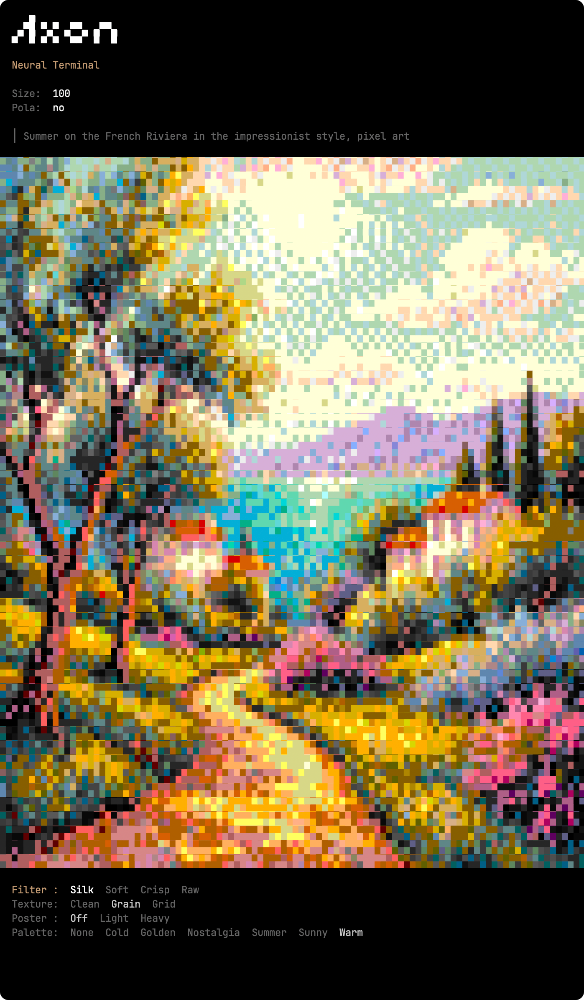

# Axon

CLI tool that generates images from text prompts using Google Gemini and renders them directly in your terminal using ANSI 256 colors and Unicode half block characters.

 

## Features

- Text to image generation via Google Gemini API
- 256 color terminal rendering with half block characters
- Interactive mode with animated logo and live settings
- Real time filter, texture, posterize and palette controls
- Custom palettes via PNG LUT files (create your own in Photoshop)
- Polaroid style border with optional caption
- Save original image, 256 color preview and JSON export

## Requirements

- macOS or Linux
- Python 3.9+
- A terminal with 256-color support
- A Google Gemini API key ([get one here](https://aistudio.google.com/apikey))

## Installation

```bash
git clone git@github.com:hooop/axon.git
cd axon
pip install -e .
```

Set your API key:

```bash
export GOOGLE_API_KEY=your_key_here
```

## Usage

### Interactive mode

```bash
axon
```

Launches the full interface: animated logo, configuration prompts (size, polaroid border), then a text prompt. After generation, navigate the settings menu with arrow keys to adjust the rendering in real time.

> Tip: Adding "pixel art" to your prompt produces images that render best in terminal.

### Direct mode

```bash
axon "a picnic on the grass, impressionist style, pixel art"
```

Options:

```
--width N     Terminal columns for rendering (default: auto-detect)
--size N      Generated image resolution: 512, 768, 1024 (default: 768)
--pola        Add a polaroid-style white border
--caption TXT Caption text on the polaroid border
```


## Settings menu

After image generation, use arrow keys to tweak the rendering:

```
Filter:   Silk (Lanczos) / Soft (Bilinear) / Crisp (Bicubic) / Raw (Nearest)
Texture:  Clean (none) / Grain (Floyd-Steinberg) / Grid (Bayer ordered)
Poster:   Off / Light (4 levels) / Heavy (2 levels)
Palette:  None / custom LUTs from palettes/ folder
```

Press Enter to confirm, then choose to save and/or export.

## Custom palettes

1. Open `axon_palette_256.png` in Photoshop (16x16 grid of all 256 ANSI colors)
2. Apply any adjustments (curves, hue/saturation, color balance...)
3. Save as PNG in the `palettes/` folder
4. The palette appears automatically in the menu next time you run Axon
